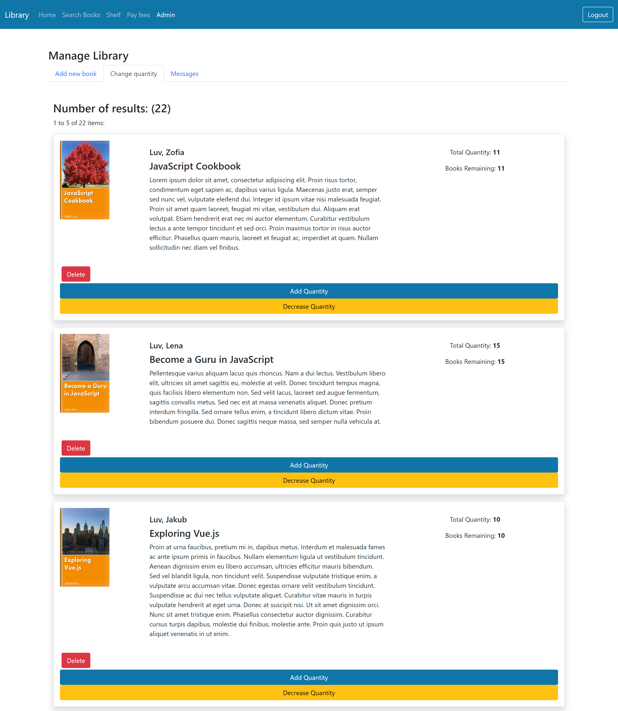
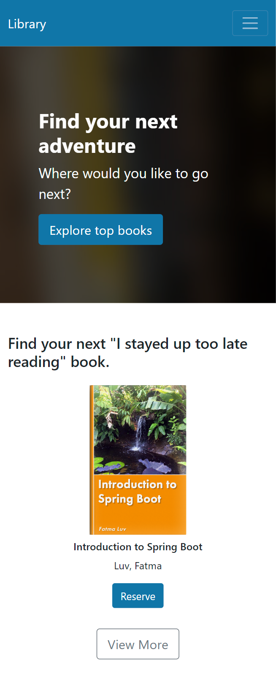

# Library

### Description

This library app provides a secure and interactive experience, featuring an Okta-based login and JWT for user
authentication and authorization. Users can browse, search, comment on, and check out books, as well as track their loan
history on a personal shelf. Administrators have the ability to manage the book inventory and respond to questions from
users. The app includes Stripe integration for handling overdue fines and features a responsive design to ensure optimal
usability across various devices.

### Technologies Used

- React.js
- Typescript
- Bootstrap
- Spring Boot
- Spring Data JPA
- Rest Repositories
- MySQL
- Okta
- JWT
- Stripe
- Docker

### Key Features

- **Authentication:** Implements Okta for secure user authentication, enabling login through Okta's secure interface for
  both regular and administrator users.
- **Authorization:** Utilizes JWT for secure authorization and access control within the application.
- **Book Management:** Enables users to browse, search, comment on, and check out books.
- **Shelf:** Enables users to track their loaned books and borrowing history.
- **Administrator System:** Enables administrators to manage the library's inventory by adding, deleting, or modifying
  the quantity of books, and to respond to questions from users, all through a special admin account.
- **Payment Processing:** Implements an automated system to charge users for overdue books and uses
  Stripe for payment transactions.
- **Responsive Design:** Supports various screen sizes for an optimal user experience across devices.

### Screenshots

- **Login Page**

  

- **Home Page**

  

- **Search Page**

  

- **Checkout Page**

  

- **Shelf**

  
  

- **Administrator System**

  
  
  

- **Payment Processing**

  
  

- **Q&A**

  
  

- **Mobile Version of Home Page**

  